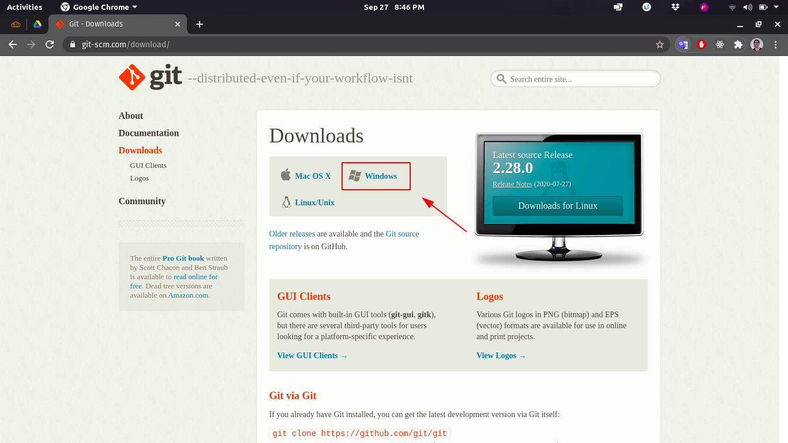
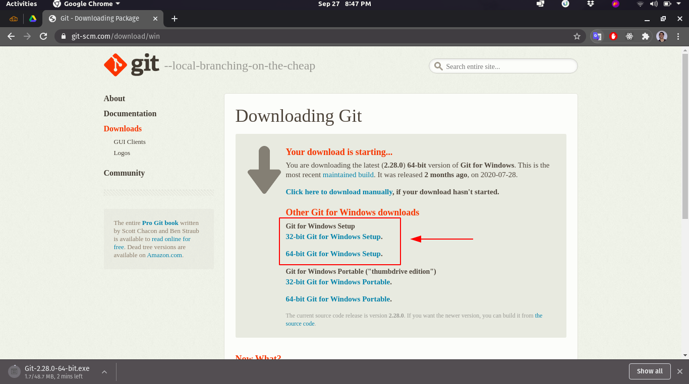

# Instalação

A instalação do git pode ser feita de algumas formas. Abaixo você encontrará algumas delas.

<p align="center"> <a href="#Linux">Linux ❤️</a> | <a href="#Windows">Windows</a></p>

# Linux

## Debian/Ubuntu

Para o Debian, a instalação poderá ser feita executando o seguinte comando no seu terminal:

```bash
$ apt-get install git
```

No Ubuntu, talvez seja necessário adicionar um PPA antes da instalação, então a instalação será feita assim:

```bash
$ add-apt-repository ppa:git-core/ppa
$ apt update
$ apt install git
```

**Atenção**: Para diferentes distros, consulte <a href="https://git-scm.com/download/linux">aqui</a>.

<br/>

# Windows

## Modos de instalação

- <a href="#gerenciador-de-pacotes">Gerenciador de pacotes</a>
- <a href="#setup-wizard">Setup Wizard</a>

## Gerenciador de pacotes

Diferentemente do Linux, o windows não possue um gerenciador de pacotes nativo.

Para tal finalidade, eu aconselho fortemente o uso do gerenciador de pacotes [Chocolatey](https://chocolatey.org/).

Você pode conferir sua instalação do [site oficial](https://chocolatey.org/), ou seguir para este outro [guia 📖](./INSTALL_CHOCOLATEY.md).

Após a instalação do chocolatey, você poserá usá-lo para instalar o git com o seguinte comando:

```powershell
choco install git

# ou ainda
cinst git
```

Agora você já deve ser capaz de executar comando do git, como, por exemplo: _`git --version`_.

<br/>

## Setup Wizard

<br/>

Outra maneira possível de instalação, é utilizando o assistente de instalação. Para isso, acesse *https://git-scm.com/download/*.

Dentro da página, selecione o seu sistema operacional (Windows):



<br/>

Logo em seguida, um download será iniciado automáticamente, se este não inicar, você pode fazê-lo manualmente no botão, ou ainda escolher a arquitetura do processador, se assim desejar.

<br/>



<br/>

Após o *download*, basta seguir o passo a passo do assistente e após a finalização, você terá o *git* instalado no seu sistema! 

[⬅️ Voltar ao tutorial](./README.md).