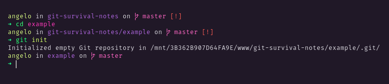
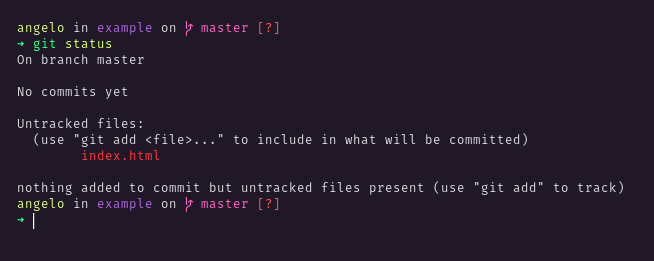
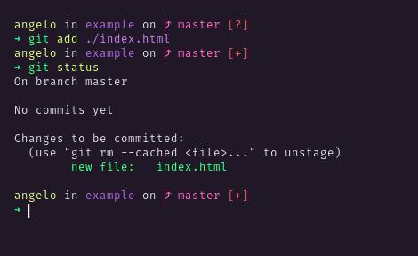
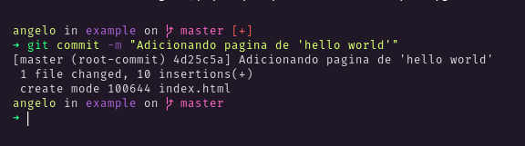
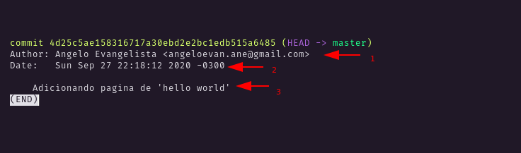
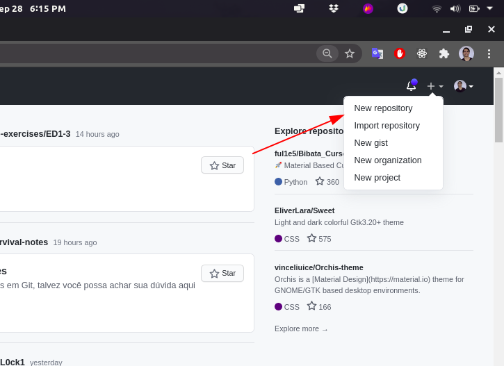
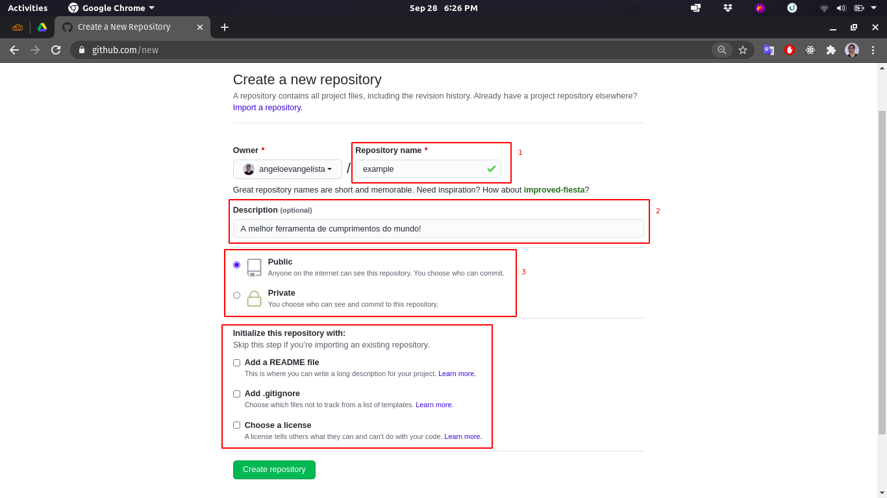
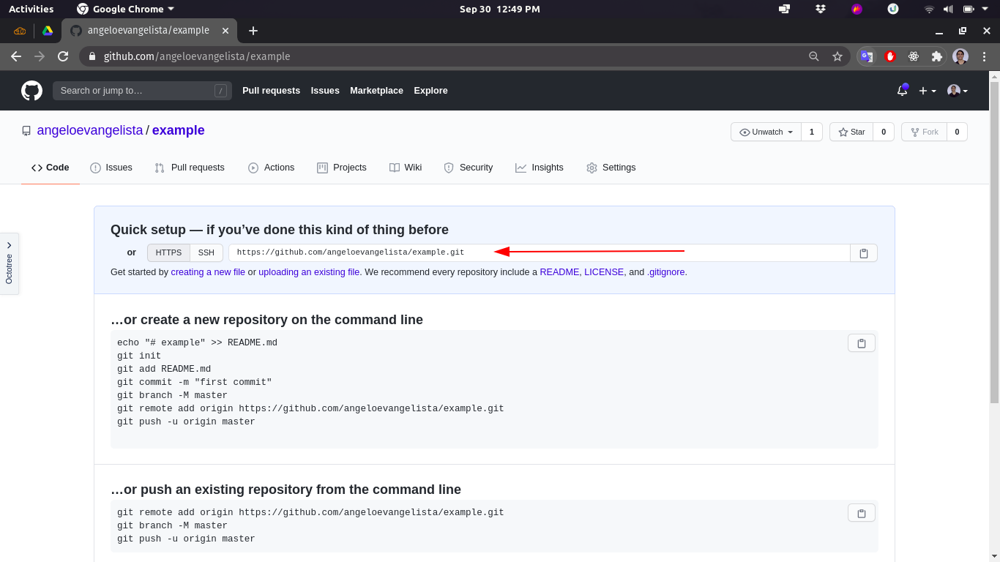
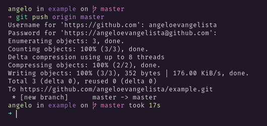
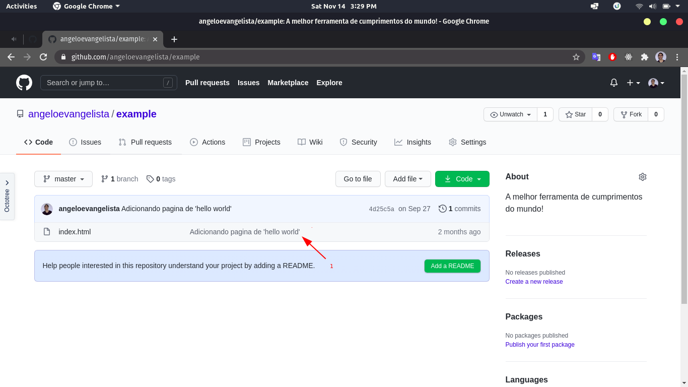

<h1 align="center">


</h1>

<h3 align="center">
  Git Tuto
</h3>
<p>

<p align="center">Esperamos que este tutorial possa te ajudar a dar seus primeiros passinhos com o git. 😉</p>

# Indice

- <a href="#instalação">Instalação</a>
- <a href="#configuração-inicial">Configuração inicial</a>
- <a href="#iniciando-um-repositório">Iniciando um repositório</a>
- <a href="#criando-pontos-na-história">Criando pontos na história (Commits)</a>
- <a href="#criando-um-repositorio-no-github">Criando um repositório no GitHub</a>
- <a href="#sincronizando-um-repositório-local-com-o-publicado">Sincronizando um repositório local com o publicado</a>

# Instalação

Para comerçarmos será necessário instalar o _[git](https://git-scm.com/)_ no seu sistema, você pode seguir os procedimentos na [página oficial](https://git-scm.com/) ou seguir para [este tutorial](./INSTALL_GIT.md) mais específico.

<br/>

# Configuração inicial

Agora que temos o Git instalado no nosso sistema, vamos às configurações iniciais. Por agora, vamos configurar o seu **_nome de usuário_** e o seu **_email_**. Essas informações são necessárias para que você seja capaz de realizar commits, que são os "Pontos na história", veremos como criá-los mais a frente. 😉

Para as configurações citadas, basta executar os seguintes comandos, substituindo os valores:

```bash
$ git config --global user.name "Seu Nome"

# Ex.: git config --global user.name "Angelo Evangelista"


$ git config --global user.email "seu_email@dominio.com"

# Ex.: git config --global user.email "angeloevan@gmail.com"

```

Pronto, a partir de agora podemos ir para o próximo passo.

<br/>

# Iniciando um repositório

Um repositório do git é basicamente uma "pasta" na qual você terá o controle de versionamento, isto significa que você terá uma sequência de mudanças e poderá "navegar" entre elas.

Imagine então que o seu código está numa linha do tempo, e que você terá um controle temporal sobre ela, logo, poderá restaurar para qualquer "momento na história" que desejar, mas é claro, você precisará definir estes "pontos".

<br/>

Para iniciar um repositório vazio, basta rodar o comando _`init`_:



A partir de agora qualquer alteração nesta pasta será "enxergada" pelo git, e podemos adicionar o que mudamos para um "grupo de mudanças", o que chamamos de _commit`_.

<br/>

# Criando pontos na história

Faremos um exemplo seguindo os seguintes passos:

1. Criaremos um arquivo `html` simples, com o nosso querido <a href="https://www.youtube.com/watch?v=Yw6u6YkTgQ4" target="_black">Hello, World</a>.

1. Verificaremos o que foi alterado no nosso projeto/pasta.

1. Após isso, adicionaremos o arquivo criado ao grupo de arquivos que serão usados para criar um ponto de modificação na linha do tempo.

1. Criaremos um ponto na linha do tempo.

1. Veremos os pontos na nossa linha do tempo.

**Let's Go! 🚀**

<br/>

**Passo 01:**


Podemos ver um html bem simples, mas muito simpático.

<br/>

**Passo 02:**



Utilizando o comando _`status`_ nós podemos ver todas as alterações feitas na pasta, mudanças como _**adições**_, _**remoções**_, de arquivos, ou mesmo _**alterações**_ no conteúdo destes.

<br/>

**Passo 03:**

Para adicionar arquivos ao _commit_, nós precisamos usar o comando _`add`_. Sua sintaxe é a seguinte:

```bash

$ git add arquivo_expecifico.ext

$ git add arquivo_01.ext arquivo_02.ext ...

$ git add diretório

# Ex.: git add ./
#                 Diretório atual inteiro

```

Agora adicionaremos nosso `index.html`.



Se executarmos o comando `status` novamente, veremos que um arquivo foi adicionado com sucesso.

<br/>

**Passo 04:**

A partir de agora, chamaremos nossos pontos na linha do tempo de _'commits'_.

Para criar um _commit_, nós usamos o comando `commit`, sim é isso mesmo 😅. Sua sintaxe é a seguinte:

```bash
$ git commit -m "Sua mensagem descritiva"

# Ex.: git commit -m "Validando dados do formulário"
```

Vejamos como fica nosso exemplo...



**Atenção:** É de extrema importância que a descrição usada nos commits seja clara e objetiva, é ela que você vai usar para entender facilmente o que foi alterado naquele ponto da história, então nada de _"Alterando projeto..."_

<br/>

**Passo 05:**

Como todo bom viajante do tempo, nós precisamos de uma forma para saber do passado, faz sentido?

Para vermos os commits anteriores, usaremos o comando _`log`_, vejamos:



**Informações**

1. Autor do commit, quem realizou o commit.
1. Data em que o commit foi realizado.
1. Mensagem inserida no momento do commit

O _hash_ em amarelo no topo é o que usaremos futuramente para navegar entre os commits, mas calma, tudo a seu tempo...

**Atenção**
Para fechar esta listagem, basta pressionar a tecla `'q'`. Viu só? É bem mais fácil do que fechar o [Vim](https://www.vim.org/) (risos).

<br/>

# Criando um reposotório no GitHub

Algo que você com certeza vai querer fazer com seu repositório, é salvá-lo na nuvem, e existem alternativas melhores do que um serviço de armazenamento em nuvem para arquivos convencionais, e estamos falando de plataformas como o [GitHub](https://github.com/).

Após acessar a plataforma, e criar uma conta, vamos criar um novo repositório.



Você pode dar o nome que preferir ao seu repositório, eu utilizarei _`example`_.



**Blocos:**

1. Nome do repositório, deve ser único. É interessante, também, nomear seus repositórios em [kebak-case](https://wiki.c2.com/?KebabCase).

1. Este campo é opcional, mas aconselho colocar uma boa descrição, para chamar atenção das pessoas heheh.

1. Aqui nós definimos a visibilidade do nosso repositório, se queremos mostra-lo para o mundo (public) ou se estamos fazendo algo muito secreto e que ninguém pode saber (private).

1. Neste bloco nós temos alguns atalhos que vão nos facilitar na criação de alguns arquivos:

- **README** -
  Este arquivo é como uma página de boas vindas, nele você poderá escrever um documento, escrito em [markdown](https://www.markdownguide.org/) que é exibido na raiz de seu repositório, como este que você está lendo. 🤫

- **.gitignore** -
  Nós usaremos este carinha para dizer ao git quem ele não precisa observar, todo mundo que estiver aqui, não aparecerá na lista de itens alterados, por exemplo.

- **License** -
  O arquivo de licença especificará sob qual licença o seu repositório está. Se todo mundo pode usar seu projeto, se precisam de permissão... Apenas encontre uma que atenda suas necessidades.

Por fim, criado!

# Sincronizando um repositório local com o publicado

Agora que nós já temos um repositório no Github, vamos atualizá-lo com o nosso _repo_ (apelido carinhoso para 'repositório') local.

Para começarmos, precisaremos do _link_ de nosso repositório no Github, ele pode ser obtido aqui:



E no terminal, dentro de nosso repo, adicionaremos uma referência ao `origin`, para isso utilizaremos o seguinte comando:

```bash
$ git remote add origin LINK_DO_REPOSITORIO
```

Para conferir se tudo ocorreu bem, use

```bash
$ git remote -v
```

Abaixo a execução:


Agora basta que enviemos as alterações para o repositório remoto.

```bash
$ git push origin BRANCH
```

A branch é a linha do tempo na qual se está, no nosso caso, usaremos a _`master`_, esta é a branch principal, tome cuidado com ela, pois ela é a sua branch "estável".

Talvez você precise fazer login ao executar o comando, basta seguir os passos pelo terminal ou wizard.



Agora você pode conferir se o projeto está mesmo no servidor:



1. Ao lado de cada arquivo, você terá a mensagem do último `commit` que afetou este arquivo, seja por adição ou modificação.
